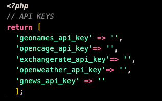
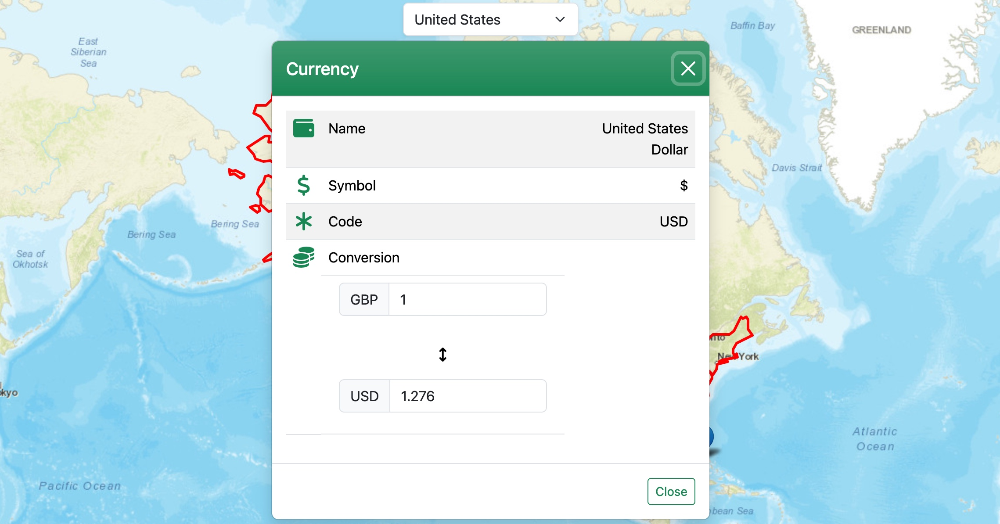

# Gazetteer <!-- omit from toc -->

https://seankennelly.com/gazetteer

- [Project Outline](#project-outline)
- [Installation](#installation)
- [Technologies](#technologies)
- [Key Features](#key-features)
  - [Get User Location](#get-user-location)
  - [Pull Country Info](#pull-country-info)
  - [Buttons](#buttons)
    - [Info](#info)
    - [Currency](#currency)
    - [Current Weather](#current-weather)
    - [Wikipedia Links](#wikipedia-links)
    - [News](#news)
    - [Toggle Buttons](#toggle-buttons)
    - [Home](#home)
  - [Known Issues](#known-issues)
  - [Prospective Improvements](#prospective-improvements)

---

## Project Outline
The brief for this project was to a creative an interactive gazetteer-style map web application, populated by geographical data pulled from APIs. The app needed to be responsive and pull data from a variety of sources to create an interesting end-user experience. Due to its highly interactive nature, I have concentrated on a minimalist design, encouraging users to explore the available controls to discover functionality. 

## Installation
To run the app locally, download the files and create a `config.php` file in `libraries/php`. This file will hold your API keys for the following APIs:
- GeoNames (from [GeoNames.org](https://www.geonames.org/manageaccount))
- OpenCage (from [OpenCagedata.com](https://opencagedata.com/api))
- OpenWeather (from [OpenWeathermap.org/api](https://openweathermap.org/api))
- ExchangeRate (from [ExchangeRate-api.com](https://www.exchangerate-api.com/))

As of August 2024 all of these API keys can be gotten for free. OpenWeather's free option is a little tricky to find but a `Subscribe for free` link is in the footer. 

Set out the file like in the below diagram and fill in the variables with the associated API keys. These will be fed to the cURL requests in various PHP files.

## Technologies
This application makes use of:
- HTML
- CSS
- Bootstrap
- JavaScript
- jQuery
- PHP
- Leaflet JS Library
- Leaflet Extra Markers
- Leaflet Marker Clusters
- Leaflet Easy Buttons
- Font Awesome Icons

## Key Features
### Get User Location
Upon initial page load, the browser passes user coordinates to the app, which centres map visuals and pulled data on their home country. Although the user is able to move around the globe and examine other countries, this data is stored so that the user can always return home, and for use in the currency converter.

### Pull Country Info
Whichever country is selected by the user has its data pulled and displayed. On initial page load this is for the user's location country. Data is fed to map layers and modals. The country's cities data is automatically added to the map.

### Buttons
#### Info
The info modal displays data on the selected country, including:
- Capital city
- Population
- Area
- Flag
- Timezone
- Telephone code
- Driving Side
- Speed Unit

#### Currency
The currency modal displays the name, symbol and currency code for the selected country. It also has a converter function, which is set to always offer the country's exchange rate with the user's home country:

#### Current Weather
This modal shows current weather for the selected country, including:
- Current weather (sunny, cloudy etc)
- Temperature
- Wind Speed
- Wind Gust
- Humidity

#### Wikipedia Links
This modal shows the top Wikipedia links for the selected country.

#### News
This modal shows the top 10 headlines for the country that has been selected.

#### Toggle Buttons
The three toggle buttons will show or hide map information pertaining to:
- Landmarks
- Hospitals
- Airports

#### Home
The blue Home button will take them back to their location country.

### Known Issues
- Unfortunately due to the nature of working with APIs and third-party data sources, not all of the information can be guaranteed to be reliable. Some of OpenCage's data has been found to be incorrect, despite my API calls being specific and adhering to their documentation. This failing is addressed [here](https://opencagedata.com/api#ambiguous-results). Despite this, extensive testing has shown that nearly all data displayed by my app is reliable and correct.
- The app's intial load time is also dependent on it's initialsing API calls, so despite being lightweight in size it can be sluggish to start.
- News from other countries is in that country's language. I experimented with pulling only results in the English language, but since most countries don't publish their news in English this meant that the modal was mostly blank.

### Prospective Improvements
To prevent 'project creep' I gave myself targets to hit and restricted myself from following too many ideas that sprung up during the build. I adhere to the mantra 'Finished is better than perfect' (since perfect never gets finished). However I did take note of ideas for improvement, many of which I hope to come back to:

- Replace alerts with Bootstrap Toasts. The alerts the site currently uses are in case of errors, and so far in testing I have not come across them. This can be considered a minor improvement.

- Get more airport information. My preferred source of airport information was AirLabs, but when I signed up for my API key I was informed that due to high numbers of signups, they are now manually assessing API key requests, and I was unable to get mine in time for this project.

- Addition of a News Modal